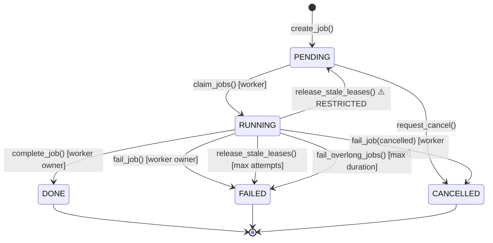

# 🔒 Job State Contract v2

> State machine chính thức cho Job lifecycle. Mọi code thay đổi job status PHẢI tuân thủ contract này.

---

## 1. State Machine



### Transition Rules

| From | To | Trigger | Guard | Privilege |
|---|---|---|---|---|
| `—` | `PENDING` | `create_job()` | — | API |
| `PENDING` | `RUNNING` | `claim_jobs()` | `!cancel_requested` | Worker only |
| `PENDING` | `CANCELLED` | `request_cancel()` | — | API |
| `RUNNING` | `DONE` | `complete_job()` | `worker_id` match + lease valid | Worker owner only |
| `RUNNING` | `FAILED` | `fail_job()` | `worker_id` match + lease valid | Worker owner only |
| `RUNNING` | `CANCELLED` | `fail_job(cancelled=true)` | `worker_id` match + lease valid | Worker owner only |
| `RUNNING` | `PENDING` | `release_stale_leases()` | lease expired + `attempts < max` | **System only** ⚠️ |
| `RUNNING` | `FAILED` | `release_stale_leases()` | lease expired + `attempts >= max` | **System only** |
| `RUNNING` | `FAILED` | `fail_overlong_jobs()` | `started_at` > `MAX_DURATION` | **System only** |
| Terminal | `*` | ❌ BLOCKED | — | Nobody |

### ⚠️ Dangerous Transition: RUNNING → PENDING

> [!CAUTION]
> `RUNNING → PENDING` là transition nguy hiểm nhất vì tạo retry loop.
> - **CHỈ** `release_stale_leases()` được phép thực hiện (system-level method)
> - **KHÔNG** cho API endpoint hoặc worker code gọi trực tiếp
> - Phải kèm `attempt_count < max_attempts` guard, nếu không → vòng lặp vô tận
> - Method này chạy trong worker poll loop, KHÔNG expose qua HTTP

### 🔄 Retry Policy: Clone, Không Resurrect

> [!IMPORTANT]
> **Terminal Finality là tuyệt đối.** Job đã `FAILED`/`CANCELLED` KHÔNG BAO GIỜ được chuyển lại `PENDING`.
>
> Nếu cần retry từ UI/API → **tạo job mới** (clone payload từ job cũ):
> ```
> POST /jobs/{id}/retry → tạo job mới với same payload, link parent_job_id
> ```
> Không resurrect job cũ. Giữ nguyên audit trail.

---

## 2. Invariants

1. **Terminal Finality**: Terminal state → KHÔNG thay đổi status nữa. Không có ngoại lệ.
2. **Terminal Has finished_at**: `status ∈ {DONE, FAILED, CANCELLED}` → `finished_at != None`
3. **Terminal Clears Runtime**: Terminal → clear `worker_id`, `lease_expires_at`, `pid`
4. **Running Has Worker**: `status == RUNNING` → `worker_id != None`
5. **Every Exception → Terminal**: Mọi exception trong `run_job()` PHẢI kết thúc bằng terminal state
6. **Worker Ownership**: `complete_job()` / `fail_job()` PHẢI check cả `worker_id` match VÀ lease chưa expired. Worker cũ không được complete/fail job đã bị worker khác claim lại.
7. **DONE Progress = 100**: Khi `status == DONE` → `progress == 100`. `complete_job()` PHẢI set progress=100.
8. **Terminal Freezes Progress**: Khi ở terminal state → `progress`, `current_step`, `step_index` KHÔNG được thay đổi. `update_progress()` PHẢI reject nếu `status.is_terminal`.
9. **Progress Monotonic**: `progress` chỉ tăng hoặc giữ nguyên trong suốt lifecycle (trừ khi job quay về PENDING qua stale lease → reset progress=0).

### Webhook / Callback Semantics

| Terminal State | Webhook Event | Lần gửi |
|---|---|---|
| `DONE` | `job.completed` | Đúng 1 lần |
| `FAILED` | `job.failed` | Đúng 1 lần |
| `CANCELLED` | `job.cancelled` | Đúng 1 lần |

**Rules:**
- Terminal webhook PHẢI được gửi bởi `_notify_terminal()` — chỉ gọi 1 lần khi status chuyển sang terminal.
- `heartbeat()`, `release_stale_leases()`, `fail_overlong_jobs()` KHÔNG được gửi webhook nếu job đã ở terminal (vì guard sẽ skip).
- Webhook dispatch phải **idempotent**: nếu hệ thống crash giữa chừng và reaper chạy lại, KHÔNG gửi lặp terminal event.
- Cách implement: dùng flag `terminal_notified: bool` trên JobRecord, hoặc check `finished_at` đã set trước khi gửi.

---

## 3. Audit Code Hiện Tại — 8 Lỗ Hổng

| # | Lỗ hổng | Severity | File |
|---|---|---|---|
| 1 | `_build_workflow()` ngoài try/except → vi phạm Invariant #5 | 🔴 Critical | `core/pipeline.py:50` |
| 2 | `heartbeat()` ghi đè status=RUNNING bất kể terminal → vi phạm #1 | 🔴 Critical | `core/job_manager.py:146` |
| 3 | `complete_job()` không check `status==RUNNING` trước | 🔴 High | `core/job_manager.py:220` |
| 4 | `fail_job()` không check `status==RUNNING` trước | 🔴 High | `core/job_manager.py:248` |
| 5 | `release_stale_leases()` không limit retry → loop vô tận | 🔴 High | `core/job_manager.py:270` |
| 6 | Không có zombie reaper cho job chạy quá lâu (heartbeat sống nhưng job treo) | ⚠️ Medium | — |
| 7 | API không expose `is_terminal` → client phải hardcode | ⚠️ Medium | `api/schemas.py` |
| 8 | `cancel` trên RUNNING chỉ set flag, không guarantee termination | ⚠️ Medium | `core/job_manager.py:168` |

---

## 4. Implementation

### 4.1 State Machine trong Model

```python
# core/models.py
class JobStatus(str, Enum):
    PENDING = "pending"
    RUNNING = "running"
    DONE = "done"
    FAILED = "failed"
    CANCELLED = "cancelled"

    @property
    def is_terminal(self) -> bool:
        return self in _TERMINAL_STATES

    def can_transition_to(self, target: "JobStatus") -> bool:
        return target in _TRANSITIONS.get(self, frozenset())

_TERMINAL_STATES = frozenset({JobStatus.DONE, JobStatus.FAILED, JobStatus.CANCELLED})

_TRANSITIONS: dict[JobStatus, frozenset[JobStatus]] = {
    JobStatus.PENDING:   frozenset({JobStatus.RUNNING, JobStatus.CANCELLED}),
    JobStatus.RUNNING:   frozenset({JobStatus.DONE, JobStatus.FAILED,
                                     JobStatus.CANCELLED, JobStatus.PENDING}),
    JobStatus.DONE:      frozenset(),
    JobStatus.FAILED:    frozenset(),
    JobStatus.CANCELLED: frozenset(),
}
```

> **Lưu ý**: `RUNNING → PENDING` nằm trong `_TRANSITIONS` nhưng **chỉ** `release_stale_leases()` được gọi. Transition guard ở repository layer enforce ownership.

### 4.2 Repository Guards

```python
# core/job_manager.py

def _assert_transition(self, record: JobRecord, target: JobStatus) -> None:
    if not record.status.can_transition_to(target):
        raise IllegalStateTransition(
            f"job {record.id}: {record.status.value} → {target.value}"
        )

def complete_job(self, job_id, output_path, *, worker_id: str, ...):
    """worker_id is REQUIRED — enforces ownership guard."""
    with self._lock:
        record = self._records.get(job_id)
        if record is None:
            return None
        # Guard: status + worker ownership (both mandatory)
        self._assert_transition(record, JobStatus.DONE)
        if record.worker_id != worker_id:
            return None  # stale worker, lease already taken by another
        record.status = JobStatus.DONE
        ...

def heartbeat(self, job_id, worker_id, pid, lease_seconds):
    with self._lock:
        record = self._records.get(job_id)
        if record is None or record.worker_id != worker_id:
            return None
        if record.status.is_terminal:  # ✅ Don't resurrect
            return None
        ...
```

### 4.3 Tách Zombie Reaper khỏi Stale Lease

Hai concerns khác nhau, hai methods riêng:

```python
# release_stale_leases(): lease hết hạn → worker đã chết
# Chạy mỗi poll cycle. RUNNING → PENDING (retry) hoặc FAILED (max attempts).

def release_stale_leases(self, *, max_attempts: int = 3) -> int:
    """Handle jobs whose worker lease has expired."""
    now = utcnow()
    count = 0
    with self._lock:
        for record in self._records.values():
            if (record.status == JobStatus.RUNNING
                and record.lease_expires_at
                and record.lease_expires_at <= now):
                count += 1
                record.worker_id = None
                record.lease_expires_at = None
                record.pid = None
                if record.cancel_requested or record.attempt_count >= max_attempts:
                    record.status = (JobStatus.CANCELLED if record.cancel_requested
                                     else JobStatus.FAILED)
                    record.finished_at = now
                    record.error = record.error or f"max attempts ({max_attempts}) exceeded"
                else:
                    record.status = JobStatus.PENDING  # retry
                record.updated_at = now
    return count


# fail_overlong_jobs(): heartbeat sống nhưng job chạy quá lâu
# Chạy ít thường xuyên hơn. RUNNING → FAILED.

def fail_overlong_jobs(self, *, max_duration_seconds: int = 3600) -> int:
    """Force-fail jobs running longer than max duration, even with active heartbeat."""
    now = utcnow()
    count = 0
    with self._lock:
        for record in self._records.values():
            if (record.status == JobStatus.RUNNING
                and record.started_at
                and (now - record.started_at).total_seconds() >= max_duration_seconds):
                count += 1
                record.status = JobStatus.FAILED
                record.error = f"exceeded max duration ({max_duration_seconds}s)"
                record.finished_at = now
                record.worker_id = None
                record.lease_expires_at = None
                record.pid = None
                record.updated_at = now
    return count
```

### 4.4 API: Client Actions, Không Internal Transitions

> [!IMPORTANT]
> **Không expose `allowed_transitions` cho client** — gây hiểu nhầm rằng client có thể trigger transitions.
> Thay vào đó, expose **client actions** mà họ thực sự được phép gọi:

```python
# api/schemas.py
class JobResponse(BaseModel):
    # ... existing fields ...
    is_terminal: bool = False
    can_cancel: bool = False
    can_retry: bool = False  # true nếu FAILED + retriable
```

```python
# api/routes/jobs.py
def _enrich_response(job: JobRecord) -> dict:
    data = job.to_dict()
    data["is_terminal"] = job.status.is_terminal
    data["can_cancel"] = job.status in {JobStatus.PENDING, JobStatus.RUNNING}
    data["can_retry"] = (
        job.status == JobStatus.FAILED
        and job.error_detail is not None
        and job.error_detail.retriable
    )
    return data
```

**Response ví dụ — running job:**
```json
{
  "id": "abc-123",
  "status": "running",
  "is_terminal": false,
  "can_cancel": true,
  "can_retry": false,
  "progress": 45,
  "current_step": "transcribe"
}
```

**Response ví dụ — failed retriable job:**
```json
{
  "id": "abc-123",
  "status": "failed",
  "is_terminal": true,
  "can_cancel": false,
  "can_retry": true,
  "error": "503 Edge TTS websocket",
  "error_detail": { "code": "TTS_FAILED", "retriable": true }
}
```

### 4.5 Retry Endpoint (Clone Pattern)

```python
@router.post("/{job_id}/retry", response_model=JobResponse)
def retry_job(job_id: str) -> JobResponse:
    """Create a NEW job from a failed job's payload. Never resurrects old job."""
    services = get_services()
    old = services.job_manager.get_job(job_id)
    if old is None:
        raise HTTPException(404, "job not found")
    if old.status != JobStatus.FAILED:
        raise HTTPException(409, "only failed jobs can be retried")
    if old.error_detail and not old.error_detail.retriable:
        raise HTTPException(409, "this failure is not retriable")
    
    new_job = services.job_manager.create_job(
        pipeline_type=old.pipeline_type,
        source_sha256=old.source_sha256,
        payload=dict(old.payload),  # clean copy, no internal fields
        input_path=old.input_path,
        input_uri=old.input_uri,
        metadata={**old.metadata, "retry_of": old.id, "retry_count": old.metadata.get("retry_count", 0) + 1},
    )
    return JobResponse(**_enrich_response(new_job))
```

---

## 5. Test Matrix

```python
# tests/test_job_state_contract.py

class TestStateTransitions(unittest.TestCase):
    # ✅ Legal
    def test_pending_to_running_via_claim(self): ...
    def test_pending_to_cancelled_via_cancel(self): ...
    def test_running_to_done_via_complete(self): ...
    def test_running_to_failed_via_fail(self): ...
    def test_running_to_cancelled_via_fail_cancelled(self): ...
    def test_running_to_pending_via_stale_lease(self): ...
    def test_running_to_failed_via_max_attempts(self): ...

    # ❌ Illegal
    def test_done_cannot_complete_again(self): ...
    def test_done_cannot_fail(self): ...
    def test_failed_cannot_complete(self): ...
    def test_cancelled_cannot_complete(self): ...
    def test_heartbeat_does_not_resurrect_terminal(self): ...

class TestOwnershipGuards(unittest.TestCase):
    def test_stale_worker_cannot_complete(self): ...
    def test_stale_worker_cannot_fail(self): ...
    def test_only_system_can_do_running_to_pending(self): ...

class TestInvariants(unittest.TestCase):
    def test_terminal_always_has_finished_at(self): ...
    def test_terminal_clears_worker_pid_lease(self): ...
    def test_done_sets_progress_100(self): ...
    def test_terminal_rejects_update_progress(self): ...
    def test_every_pipeline_exception_reaches_terminal(self): ...
    def test_build_phase_exception_reaches_terminal(self): ...

class TestZombiePrevention(unittest.TestCase):
    def test_stale_lease_retry_respects_max_attempts(self): ...
    def test_cancel_plus_stale_goes_to_cancelled(self): ...
    def test_overlong_job_force_failed(self): ...  # fail_overlong_jobs()
    def test_retry_creates_new_job_not_resurrect(self): ...

class TestRaceConditions(unittest.TestCase):
    """Simulate timing races between workers and system methods."""
    def test_stale_worker_complete_after_lease_expired(self): ...
    def test_heartbeat_after_terminal_is_noop(self): ...
    def test_release_stale_twice_no_double_terminal(self): ...
    def test_fail_overlong_twice_no_double_terminal(self): ...

class TestWebhookContract(unittest.TestCase):
    def test_done_sends_job_completed_once(self): ...
    def test_failed_sends_job_failed_once(self): ...
    def test_cancelled_sends_job_cancelled_once(self): ...
    def test_reaper_does_not_resend_terminal_webhook(self): ...
```

---

## 6. File Changes Summary

| File | Change | Impact |
|---|---|---|
| `core/models.py` | `is_terminal`, `can_transition_to()` | Model |
| `core/exceptions.py` | `IllegalStateTransition` | Error |
| `core/job_manager.py` | `_assert_transition()` guards in all mutations | **Core safety** |
| `core/job_manager.py` | `heartbeat()` skip terminal | Anti-resurrection |
| `core/job_manager.py` | `release_stale_leases()` + max_attempts | Anti-retry-loop |
| `core/job_manager.py` | `fail_overlong_jobs()` — **separate method** | Anti-zombie |
| `core/pipeline.py` | Wrap build phase in try/except | Exception→terminal |
| `api/schemas.py` | `is_terminal`, `can_cancel`, `can_retry` | Client actions |
| `api/routes/jobs.py` | `_enrich_response()` + `POST /retry` | API contract |
| `config/settings.py` | `MAX_JOB_ATTEMPTS`, `MAX_JOB_DURATION_SECONDS` | Config |
| `tests/test_job_state_contract.py` | ~30 test cases (transitions, ownership, invariants, race conditions, webhook) | **Safety net** |

---

## 7. Roadmap Position

**Phase 1.6** trong Stabilize sprint — làm cùng lúc với 1.1 (pipeline error boundary).

```
Phase 1: STABILIZE
├── 1.1 Fix PipelineRunner Error Boundary
├── 1.2 Early Validation at API Layer
├── 1.3 TTS Retry + Fallback
├── 1.4 Cancel Flow
├── 1.5 Re-run n8n Webhook Test
└── 1.6 Job State Contract ★
    ├── State machine + transition guards
    ├── Worker ownership enforcement
    ├── Progress invariants (#7-9)
    ├── Stale lease retry (max_attempts)
    ├── Overlong job reaper (separate method)
    ├── Client-action API (is_terminal, can_cancel, can_retry)
    ├── Webhook idempotency (terminal_notified guard)
    ├── Retry-via-clone endpoint
    └── 30 contract tests (incl. race conditions + webhook)
```
